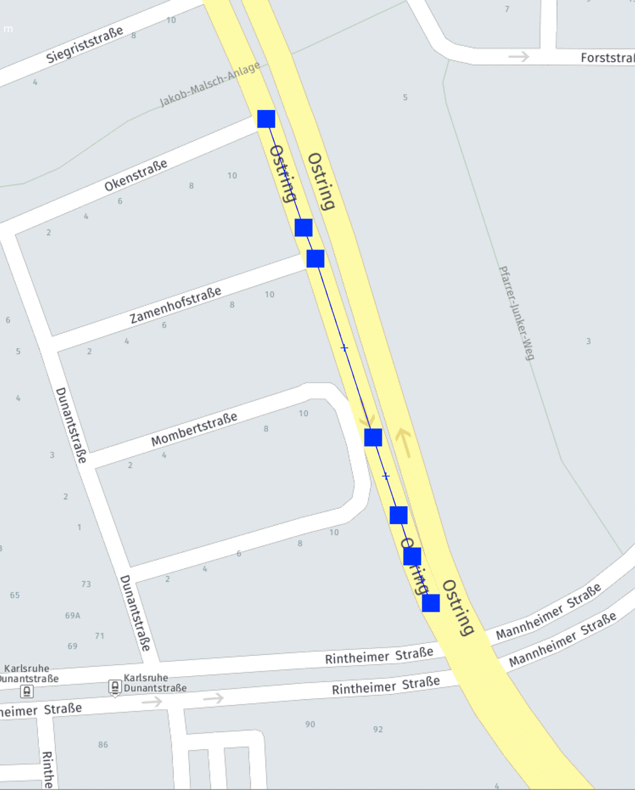
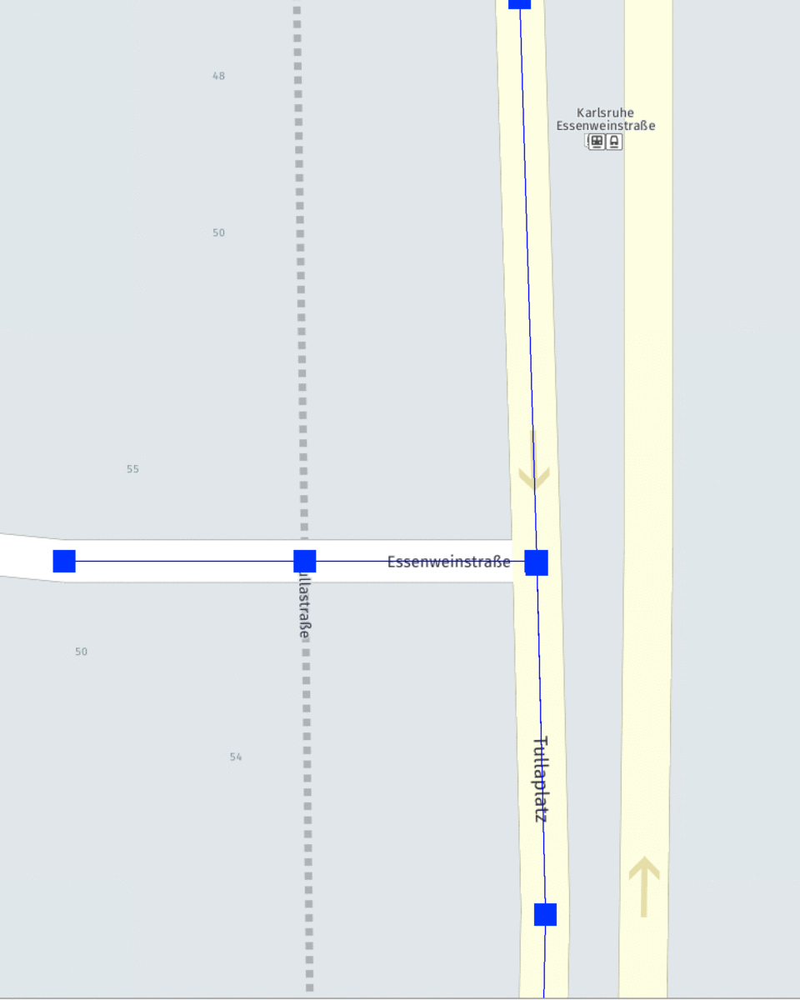
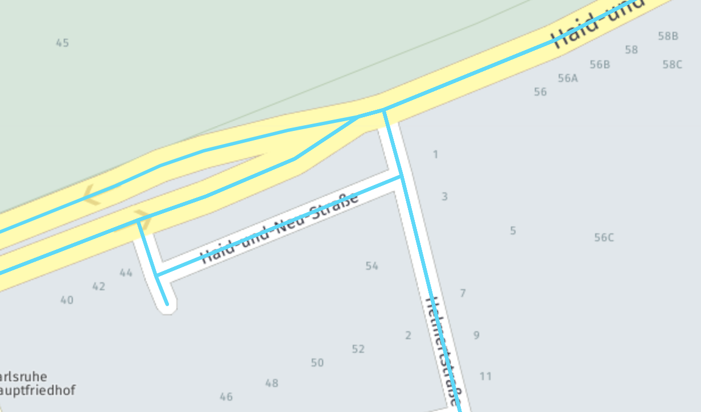
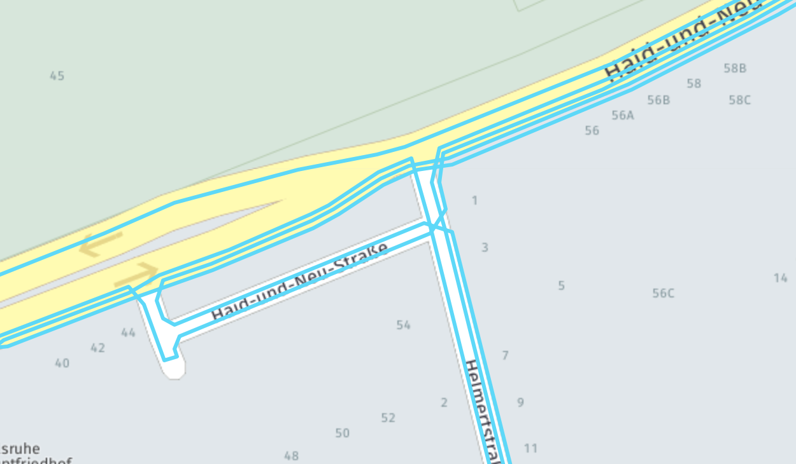

# RouteSimplifier

RouteSimplifier is a Python script that make complex navigation routes easier to view. It intelligently offsets 
overlapping parts of the route, simplifies complex intersections and exports results to either OSM or JSON.

## Installation

1. Clone this repository
2. Install dependencies using pip
    ```bash
    pip install -r requirements.txt
    ```
## Usage
Required input formatting:
```json
[
  {
    "lat": 12.3456,
    "lon": 78.91011
  },
  {
    "lat": 12.3456,
    "lon": 78.91011
  }
]
```

Run the simplifier:

 ```bash
python3 simplify.py path/to/route.json path/to/result.json
```
To change the export format, simply change the extension of the results path. Available formats: .osm, .json

## How it works

> RouteSimplifier offsets overlapping parts of the route. If a street is present 3 times in the input route, it will be
>depicted as a 3-lane street.


> RouteSimplifier makes intersections easier to view by intelligently picking the offset order depending 
>on the turn direction. It also moves some parts of the route away from the intersection to avoid overlaps.

## Example
Before:

After:



## License
[MIT](https://choosealicense.com/licenses/mit/)